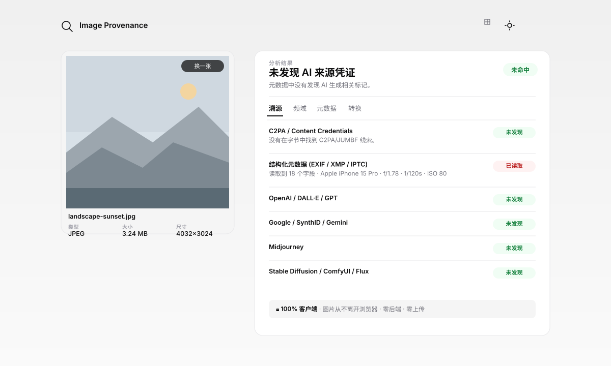
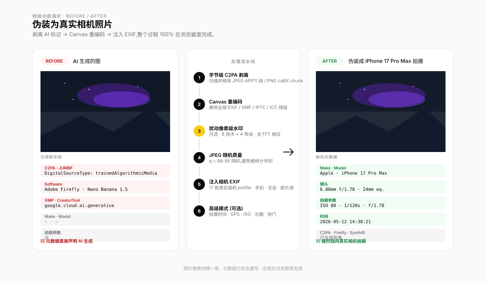

# Image Provenance

[](https://863401402.github.io/image-provenance/?lang=en)
[](LICENSE)
[](#)

[中文](README.md) · **English**

> Verify provenance credentials, inspect AI declarations and metadata, and explore frequency anomalies locally in your browser. **Images are not uploaded.** Missing labels do not rule out AI; this is not a calibrated authenticity classifier.

👉 [**Open the live demo**](https://863401402.github.io/image-provenance/?lang=en)

---

## Preview





## What it does

- **Multi-layer detection** — Verify C2PA / Content Credentials and inspect tool markers for OpenAI, Google Gemini / Imagen, Doubao / Seedream / Jimeng, Qwen-Image / HunyuanImage, Midjourney, Stable Diffusion / Flux and Adobe Firefly. This does not decode SynthID. Only strong/medium signals contribute provenance evidence.
- **Chinese AIGC declarations** — Read GB / TC260 structured metadata, preserve generated / possible / suspected labels, display producer and propagator identifiers, and detect conflicting records.
- **Metadata viewer** — EXIF / XMP / IPTC / ICC, AIGC fields, GPS privacy notes and XMP editing history. C2PA integrity and signer trust are shown separately. Camera EXIF does not prove real-world capture.
- **Frequency analysis** — 65 features extracted inside a Web Worker, a viridis FFT heatmap, normalized radial power spectrum, and a multi-family anomaly heuristic.
- **Image conversion** — Byte-level C2PA strip → EXIF orientation normalization → transparent pixels composited over white → Canvas re-encode → optional watermark processing → camera EXIF injection.
- **Pixel perturbation experiments** — 8 techniques, including real 2D-FFT phase perturbation, across 4 presets. Compare statistics before and after processing. No rotation, flip or aspect-ratio change; removal of proprietary watermarks such as SynthID is unverified.
- **Local batch processing** — Add multiple images for quick/full detection or conversion, cancel/retry jobs, and export CSV, JSON, or a manifest-backed ZIP. Images remain on the device.

## How to use

1. Select or drop JPEG, PNG or WebP images.
2. Inspect credentials, AIGC declarations and tool clues in **Detection**. Expand cards to see fields and storage locations.
3. Use **Metadata** for camera fields, generation / propagation identifiers, C2PA integrity and signer trust; use **Frequency** for statistical anomalies.
4. Switch to **Batch** for quick/full detection and CSV / JSON reports. Conversion jobs can be exported as a ZIP with a manifest.

## Interpreting results

| Information | Meaning and evidence level |
| --- | --- |
| Explicit generative AI source type in verified C2PA | Strong provenance evidence; signer trust is shown separately |
| Generator fields / complete AIGC `Label="1"` | Editable medium metadata evidence; provider identity is not verified |
| AIGC `Label="2"` / `"3"` | Possibly / suspected AI-generated; weak clues only |
| Conflicting AIGC records, or valid records accompanied by malformed data | Fields and parsing issues are retained, without a conclusive origin claim |
| Tool names in file bytes | Weak clues; mentioning a tool in a caption does not identify the generator |
| Frequency anomalies | Uncalibrated heuristics, not independent proof of AI generation |
| Camera EXIF / no labels found | Does not prove camera origin or rule out AI |

Compressed-file byte statistics are informational and do not contribute to the AI verdict. `trainedAlgorithmicMedia` and `compositeWithTrainedAlgorithmicMedia` indicate generative AI creation and editing respectively. Algorithmic art, data visualization and computational photography do not automatically imply generative AI.

## Chinese AIGC declarations

Supported storage includes JPEG APP1 XMP, PNG AIGC text chunks and XMP, and WebP XMP. EXIF `UserComment` containing complete AIGC JSON is also supported when exposed by the existing metadata reader. Fields include `Label`, `ContentProducer`, `ProduceID`, `ReservedCode1`, `ContentPropagator`, `PropagateID` and `ReservedCode2`.

Parsing checks field types, labels, container lengths and PNG text CRCs, with limits on metadata and decompression size. Provider names/codes are displayed verbatim, without automatic attribution to a verified vendor or model. CSV / JSON retain fields, storage locations and parsing issues. See [AIGC parsing details](docs/AIGC-METADATA.md).

## Stack and network requests

Zero build. A single HTML file plus ES Modules. The official C2PA WebAssembly verifier is vendored; [`exifr`](https://github.com/MikeKovarik/exifr), [`piexifjs`](https://github.com/hMatoba/piexifjs), and [`fflate`](https://github.com/101arrowz/fflate) load from a CDN only when needed. FFT / DCT / DWT, watermark techniques, and frequency features run locally in the browser.

**Local processing does not mean fully offline.** The page may also contact language-region lookup and usage-counter services; those requests do not carry image content. CDN failures may affect metadata reading, conversion or ZIP export. The AIGC container parser adds no external dependency.

## Batch mode and browser API

Switch the left pane to **Batch** and add JPEG, PNG, or WebP files. Quick detection runs with concurrency 2; full detection and conversion use concurrency 1 to bound Canvas and FFT memory. A queue accepts up to 200 jobs, including no more than 50 conversions. Quick mode checks provenance and metadata, while Full mode also runs frequency analysis.

Self-hosted integrations can call the structured analyzer directly:

```js
import { analyzeImage } from './src/analyzer.js';

const { report, details } = await analyzeImage(file, { mode: 'full' });
console.log(report.verdict, report.c2pa, report.aigc, report.frequency);
console.log(report.aigc.labels); // Fields, storage locations and parsing issues
```

Batch conversion uses `convertFile()` from `src/batch/converter.js` and returns a JPEG `Blob`, output name, dimensions, effective quality, camera profile, and processing log. See [`docs/TECHNICAL-NOTES.md`](docs/TECHNICAL-NOTES.md) for implementation rationale.

## Run locally

```bash
git clone https://github.com/863401402/image-provenance
cd image-provenance
python3 -m http.server 8000   # open http://localhost:8000
npm test                      # run Node unit tests
```

ES Modules + Web Workers require HTTP; `file://` will not load. Development checks use Node.js's built-in test runner, without `npm install`. There are currently 69 unit tests covering evidence rules, AIGC parsing, malformed input, batch queues, reports and conversion. The test count does not measure image-detection accuracy.

## Current limitations

- Input is limited to JPEG, PNG and WebP; HEIF / TIFF are unsupported.
- AIGC parsing does not support JPEG Extended XMP, complex nested XMP properties or verification of provider-specific reserved fields.
- No visible-label OCR or proprietary pixel-watermark decoding, including SynthID.
- Screenshots, platform saving, editing and re-encoding may remove or alter metadata.
- No systematic evaluation across real vendor outputs and social-media re-encodes yet; frequency scores are not AI probabilities.

## Accuracy & ethics

**Doubao and invisible watermarks:** Metadata and byte clues include Doubao / Seedream / Jimeng and Qwen-Image / HunyuanImage, but there is no dedicated watermark decoder or classifier that guarantees identification. Visible labels require manual inspection. No detection does not prove that an image is not AI-generated.

**SynthID:** This tool does not decode SynthID or verify proprietary watermark removal. [Google offers image verification in Gemini](https://blog.google/innovation-and-ai/products/ai-image-verification-gemini-app/). Using that service requires separately uploading an image to Google; this app does not perform that upload or import external verification results.

Source-type distinctions follow the [IPTC vocabulary](https://cv.iptc.org/newscodes/digitalsourcetype/). Ingredient source types are not attributed to the active C2PA image.

**This is not a calibrated classifier.** [Corvi et al. 2023](https://arxiv.org/abs/2304.06408) documents spectral and spatial anomalies in generated imagery, while [AIDE 2024](https://arxiv.org/abs/2406.19435) shows that off-the-shelf detectors still fail heavily on realistic, unseen generated images. Frequency output therefore describes anomaly strength, not proof of AI generation; verified C2PA provenance should take priority.

**Watermark disruption** is for research: privacy de-identification and academic robustness evaluation. **Not endorsed** for disinformation, impersonation, or fraud. Position aligned with [WAVES (NeurIPS 2024)](https://arxiv.org/abs/2401.08573).

## Community

Implementation and maintenance notes: [technical notes](docs/TECHNICAL-NOTES.md) · [AIGC parser](docs/AIGC-METADATA.md) · [October 2026 update](docs/UPDATE-2026-10.md).

Open a [GitHub Issue](https://github.com/863401402/image-provenance/issues) for bug reports / feature requests, or start a [Discussion](https://github.com/863401402/image-provenance/discussions) for broader questions.


## License

[MIT](LICENSE)
