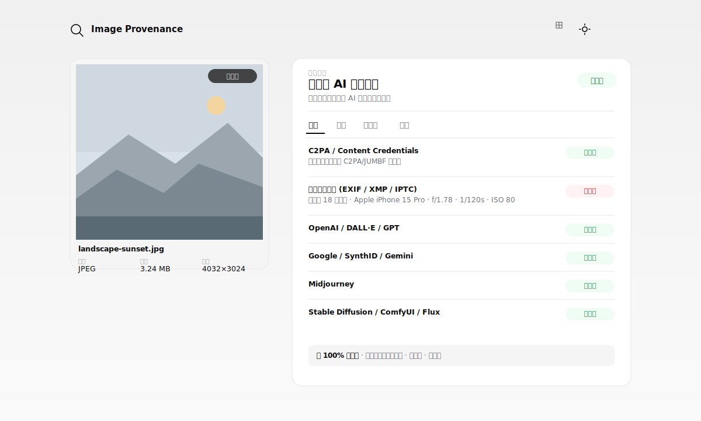
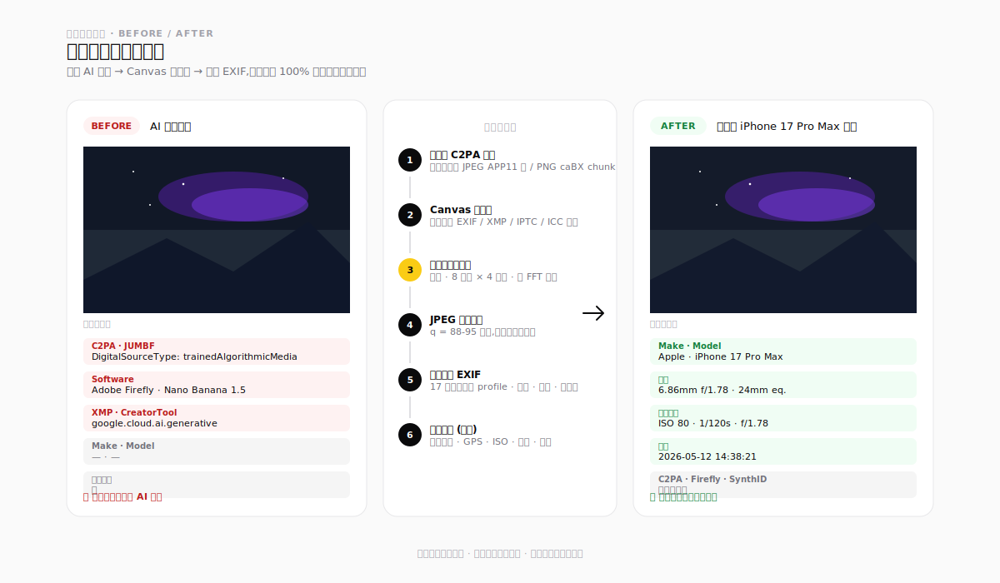

# Image Provenance

[](https://863401402.github.io/image-provenance/)
[](LICENSE)
[](#)
[](#)
[](#)

> AI 图片溯源分析工具。**100% 在浏览器里跑,图片从不离开你的设备。**

👉 [**打开在线演示**](https://863401402.github.io/image-provenance/)

---

## 界面预览

### 溯源检测(主视图)



左栏固定展示原图与文件信息,右栏切换 4 个 tab:**溯源 / 频域 / 元数据 / 转换**。上传后没有多余滚动,一屏看完所有分析产物。

### 转换功能 — 伪装为真实相机照片



AI 生成图 → 剥离 C2PA + 擦除元数据 + (可选)扰动水印 + 注入真实相机 EXIF → 图片肉眼完全一致,但从"声明为 AI 生成"变成"强烈指向真实相机拍摄"。

---

## 我在解决什么问题

一张图片传过来,你要回答三个问题:
1. 它是不是 AI 生成的?
2. 如果是真实相机拍的,元数据里有什么?GPS 会不会泄露?
3. 如果我想把自己的图彻底"清理干净"(剥元数据、剥水印、不被反向追踪),有办法吗?

大多数工具只解决第 1 个问题,而且结果要么是黑盒分数,要么把图片上传到某个服务器。**本工具在一个纯前端页面里把三件事都做了。**

## 能做什么

### 🔍 多层溯源检测

| 层级 | 信号 | 置信度 |
|---|---|---|
| 结构化 | C2PA `DigitalSourceType=trainedAlgorithmicMedia` | 强 |
| 结构化 | EXIF `Software=Midjourney/Firefly/SynthID` | 强 |
| 元数据 | XMP / IPTC 中的厂商关键字 | 中 |
| 字节级 | 厂商字符串无完整结构 | 弱 |
| 像素级 | LSB 偏差、高频比、邻接相关性启发 | 弱(参考) |

**只有强/中置信度**才拔高顶部判定为"命中"。弱信号保留显示但不惊扰用户。

### 📊 频域分析

在 Web Worker 中提取 **65 个频域特征**:

| 类别 | 特征示例 |
|---|---|
| 频谱能量 | DC、低/中/高频比、谱斜率、平坦度、谱熵 |
| 子带细分 | 7 个径向频带的能量分布 |
| 径向 / 方向 | 径向对称性、主方向、各向异性强度 |
| 相位 | 三通道相位一致性 *(SynthID 类水印的经典指征)* |
| 位平面 | LSB 偏置、邻接 LSB 相关、直方图卡方 |
| 像素统计 | 三通道均值/标准差/偏度/峰度、通道间相关 |
| 空间相关 | 水平/垂直/对角相邻相关、2-bit / 4-bit 相关断裂 |
| 小波 | Haar 2 级分解,LL/LH/HL/HH 能量与比例 |
| DCT | 8×8 块系数均值、标准差、零比例、块间方差 |

UI:**viridis 热图 FFT 谱** · **对数径向曲线** · 12 条启发式规则的加权判定 · 证据链 · 全部 65 个特征值可展开查看。

### 🗂️ 元数据详情 tab

把 `exifr` 读出来的所有字段按类别展示:

- 📸 **相机与镜头** — Make、Model、固件、镜头型号、厂商、序列号、所有者
- ⚙️ **拍摄参数** — 光圈、快门、ISO、焦距、等效 35mm、曝光补偿、测光、白平衡、闪光灯
- 🕐 **时间** — 拍摄 / 数字化 / 最后修改
- 📍 **GPS** — 经纬度、DMS、海拔、方向,**强制隐私警告** + OpenStreetMap 链接
- 🎨 **图像属性** — 色彩空间、ICC、方向、DPI
- 📝 **编辑历史** — XMP `xmpMM:History` 完整时间线
- 🛡️ **智能判定** — 基于 Make / Model / 镜头 / 参数 / MakerNote / C2PA DigitalSourceType 的联合判断:
  - 📸 **强烈指向真实相机**(全套相机字段 + MakerNote + 合理参数)
  - 📎 **仅有基础字段**(有 Make/Model 但缺 MakerNote 和拍摄参数,可能被重压缩)
  - 🤖 **元数据直接声明 AI 生成**
  - ○ **无可用元数据**(截图 / 社交媒体重编码 / 本就是 AI 图)

### 🔄 图片转换 — 剥离 + 伪装

**流水线**:字节级剥 C2PA → Canvas 重编码(擦全部元数据)→ (可选)扰动水印 → JPEG 随机质量重编码 → 注入伪 EXIF。

**17 款相机 profile**(2025-2026 年在售):

- 📱 手机:iPhone 17 Pro Max / 16 Pro / 15 Pro、Galaxy S25 Ultra、Pixel 9 Pro、小米 15 Ultra、华为 Pura 70 Ultra、vivo X200 Pro
- 📷 无反/单反:Canon R5 Mark II、Sony α1 II、Sony A7 IV、Nikon Z8、Fuji X-T5
- 🎞️ 紧凑/胶片感:Leica Q3、Ricoh GR IIIx、Fuji X100VI、GoPro Hero 13

**高级选项**(默认折叠,不改 = 推荐值):

- ⏰ 拍摄时间 — 现在 / 1小时/天/周/月/年前 / 自定义
- 📍 GPS — 不写入(推荐)+ 8 个城市地标预设
- 🔄 方向 — 1 / 6 / 8 / 3
- 🎚️ JPEG 质量 — 随机 88-95(推荐)/ 自定义 60-100
- ⚙️ ISO · 光圈 · 快门 — 全部可覆盖

### 🌀 水印扰动 v2 — 8 项技术

| # | 技术 | 目标 | 视觉代价 | 桌面耗时 |
|---|---|---|---|---|
| 1 | 几何微变换 | 几何对齐水印、dwtDct | 无 | ~20ms |
| 2 | 高斯噪声 | SDXL 默认、LSB 隐写 | 无 | ~40ms |
| 3 | 锐化补偿 | 恢复视觉柔化 | 无 | ~80ms |
| 4 | 双次 JPEG | DCT 域水印 | 无 | ~50ms |
| 5 | 通道微位移 | Stable Signature | 亚像素,不可见 | ~20ms |
| 6 | 低频带状噪声 | SynthID 近似法 | 无 | ~40ms |
| 7 | **2D-FFT 相位扰动** | **SynthID 直击** | 平面区域可能有涟漪 | ~500-800ms |
| 8 | 中值滤波 3×3 | LSB 隐写 | 轻柔化 | ~30ms |

**4 个预设 + 自定义**:

| 预设 | 技术 | 总耗时 | 适用 |
|---|---|---|---|
| 轻量 | 1+2 | ~60ms | 快速清理 |
| **推荐**(默认) | 1+2+3+4 | ~190ms | 视觉无损,大部分水印 |
| 强力 | 1+2+3+4+5+6 | ~250ms | 含跨通道对齐水印 |
| 极限 | 全 8 项 | ~1.2s | SynthID 级别,接受亚像素涟漪 |

**视觉保证**:所有技术都**不旋转、不翻转、不改宽高比**,最多亚像素级扰动。

## 技术栈

**零构建,单 HTML + ES Modules。** 依赖全部通过 CDN 按需动态 import:

- [`exifr@7.1.3`](https://github.com/MikeKovarik/exifr)(26KB gz)— 元数据解析,打开图片时加载
- [`piexifjs@1.0.6`](https://github.com/hMatoba/piexifjs)(15KB)— EXIF 注入,点击"转换"时加载

其余全部手写,零运行时依赖:FFT / DCT / DWT、JUMBF sniffer、C2PA 字节剥离、8 项水印扰动技术、65 特征提取、启发式打分。

## 本地运行

```bash
git clone https://github.com/863401402/image-provenance
cd image-provenance
python3 -m http.server 8000
# 浏览器打开 http://localhost:8000
```

ES Modules + Web Worker 需要 HTTP 协议,`file://` 打不开。

## 浏览器兼容

- Chrome / Edge 90+ · Firefox 90+ · Safari 15+ ✅
- 移动端浏览器 ✅(自动降采样到 768² 控制耗时)

需要:ES Modules、Web Workers、`createImageBitmap`、`crypto.subtle`(有纯 JS SHA-256 回退)。

## 准确性说明(请务必阅读)

**频域部分不是深度学习分类器。** 基于 2024-2026 年公开研究([Corvi et al. 2023](https://arxiv.org/abs/2304.06408)、Smudged Fingerprints 2026),**仅靠频域特征对现代扩散模型(SD / SDXL / Flux / DALL-E 3 / Gemini / Nano Banana)的二分类准确率约 70-85%**。真正的 SOTA 方法(NPR、FIRE、UnivFD)需要训练数据和模型部署,不在本项目范围。

工具的实际价值在三个层次:

1. **强信号几乎不会错** — C2PA `trainedAlgorithmicMedia`、EXIF `Software=Midjourney` 这类直接声明
2. **中等信号供参考** — 厂商关键字、过度平滑、方向性异常,组合起来才有说服力
3. **特征可视化** — 让你自己看 FFT 图、径向曲线、判定依据链条,不盲信单个数字

**水印扰动**同样是研究用途。SynthID 等现代水印不能保证被完全破坏 —— 工具能做到的是"大幅降低检测置信度",不是"保证移除"。

## 伦理立场

- ✅ 合法用途:隐私去识别、学术鲁棒性评估、个人照片元数据清理、防反向追踪
- ❌ 不鼓励:虚假新闻传播、身份伪造、欺诈

立场参考 [WAVES (NeurIPS 2024)](https://arxiv.org/abs/2401.08573) 的学术共识 —— 研究水印破坏是完善水印系统的必要环节。

## 项目结构

```
index.html              主页面
src/
├── main.js             入口:上传 / 分发 / 渲染
├── utils.js            SHA-256、格式化、DOM 辅助
├── styles.css          全部样式 (CSS tokens + light/dark)
├── detect.js           检测聚合器,输出带置信度的检测卡片
├── metadata.js         exifr + JUMBF sniffer
├── markers.js          7 类厂商签名规则表
├── watermark-detect.js 字节级水印启发
├── convert.js          C2PA 剥离 + Canvas 重编码 + EXIF 注入
├── watermark.js        8 项水印扰动 + 4 预设
├── cameras.js          17 款相机 profile + GPS 预设
├── panel-metadata.js   元数据详情 tab
└── frequency/
    ├── transforms.js   FFT / DCT / DWT
    ├── features.js     65 特征提取
    ├── score.js        启发式打分
    ├── worker.js       Web Worker 入口
    ├── index.js        主线程调度
    └── panel.js        频域 UI 渲染
```

~2500 行 JS,无运行时依赖,无构建步骤。

## 许可

[MIT](LICENSE)
