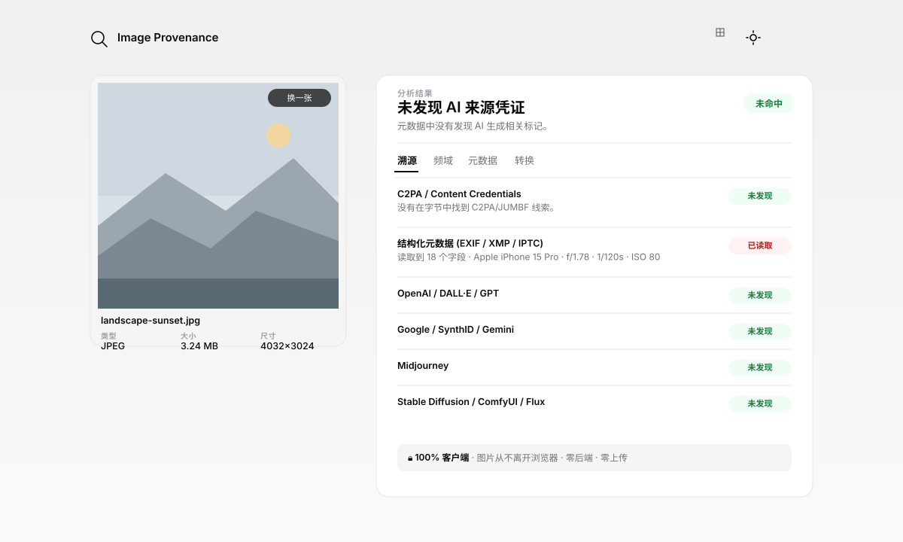
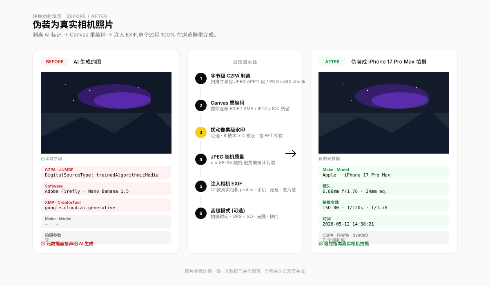

# Image Provenance

[](https://863401402.github.io/image-provenance/)
[](LICENSE)
[](#)

**中文** · [English](README.en.md)

> AI 图片溯源分析工具。**100% 在浏览器里跑,图片从不离开你的设备。**

👉 [**打开在线演示**](https://863401402.github.io/image-provenance/)

---

## 界面预览





## 能做什么

- **多层检测**:C2PA / Content Credentials、Google SynthID、OpenAI DALL-E / Sora、Midjourney、Stable Diffusion / Flux、Adobe Firefly 等 AI 生成签名。带强/中/弱置信度徽标,只有强中信号才报"命中"。
- **元数据详情**:EXIF / XMP / IPTC / ICC 全展开,GPS 带隐私警告 + OSM 链接,XMP 编辑历史完整时间线。
- **频域分析**:Web Worker 里跑 65 个特征 + viridis FFT 热图 + 归一化径向功率谱 + 多证据族启发式分析。
- **图片转换**:字节级剥 C2PA → 自动校正 EXIF 方向 → 透明区域合成白底 → Canvas 重编码 → 可选水印扰动 → 注入相机 EXIF。
- **水印扰动 v2**:8 项技术(含真 2D-FFT 相位扰动)+ 4 档预设(轻量 / 推荐 / 强力 / 极限)。不旋转、不翻转、不改宽高比。
- **本地批量处理**:多选或拖入多张图片,支持快速/完整检测、批量转换、取消/重试,并导出 CSV、JSON 或带清单的 ZIP。每张图片始终留在本机。

## 技术栈

零构建,单 HTML + ES Modules。仓库内置官方 C2PA WebAssembly 验证器;按需从 CDN 加载 [`exifr`](https://github.com/MikeKovarik/exifr)、[`piexifjs`](https://github.com/hMatoba/piexifjs) 和 [`fflate`](https://github.com/101arrowz/fflate)。FFT / DCT / DWT、8 项水印扰动和 65 项特征均在浏览器本地运行。

## 批量模式与浏览器 API

页面左侧切换到“批量”即可添加多张 JPEG、PNG 或 WebP。快速检测并发 2 个;完整检测和转换并发 1 个,避免高分辨率 Canvas 和 FFT 同时占用过多内存。单次队列最多 200 项,其中转换最多 50 项。快速检测只检查来源凭证与元数据,完整检测会继续运行频域分析。

自托管页面可以直接复用结构化分析入口:

```js
import { analyzeImage } from './src/analyzer.js';

const { report, details } = await analyzeImage(file, { mode: 'full' });
console.log(report.verdict, report.c2pa, report.frequency);
```

批量转换使用 `src/batch/converter.js` 的 `convertFile()`;返回 JPEG `Blob`、输出文件名、尺寸、实际质量、相机配置和处理日志。详细实现依据见 [`docs/TECHNICAL-NOTES.md`](docs/TECHNICAL-NOTES.md)。

## 本地运行

```bash
git clone https://github.com/863401402/image-provenance
cd image-provenance
python3 -m http.server 8000   # 打开 http://localhost:8000
npm test                      # 运行 Node 单元测试
```

ES Modules + Web Worker 需要 HTTP 协议,`file://` 打不开。

## 准确性与伦理

**不是经过校准的分类器。** [Corvi 2023](https://arxiv.org/abs/2304.06408) 说明生成图像可在功率谱和空间统计中留下异常;[AIDE 2024](https://arxiv.org/abs/2406.19435) 同时表明现成检测器面对高质量、未见过的生成图像时仍会大量失效。因此频域结果只表示异常强度,不能单独证明图片由 AI 生成;应优先采用经过验证的 C2PA 来源凭证。

**水印扰动**为学术研究用途,设计用于隐私去识别与鲁棒性评估,**不鼓励**用于虚假信息传播、身份伪造或欺诈。立场参考 [WAVES (NeurIPS 2024)](https://arxiv.org/abs/2401.08573)。

## 交流

**📱 微信交流群**(二维码过期请开 [Issue](https://github.com/863401402/image-provenance/issues))


**🔗 友情链接** · [LINUX DO](https://linux.do/) · [NodeSeek](https://www.nodeseek.com/)

## 许可

[MIT](LICENSE)
