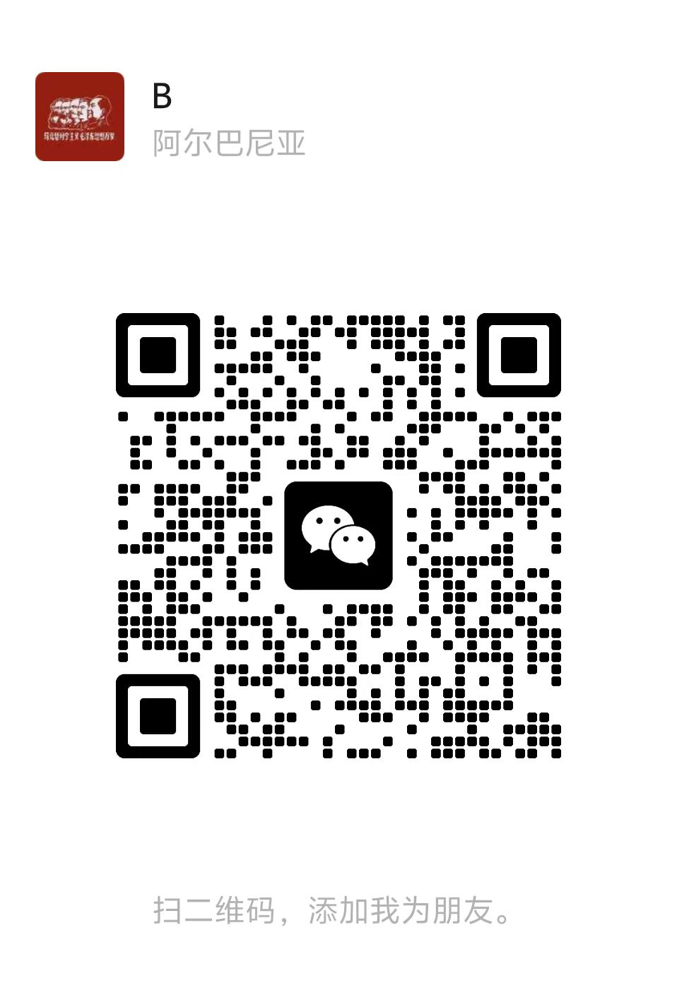

# Image Provenance

[](https://863401402.github.io/image-provenance/)
[](LICENSE)
[](#)

**中文** · [English](README.en.md)

> 在浏览器本地验证来源凭证、读取 AI 生成声明与元数据、查看频域异常。**图片不上传。** 缺少标识不代表非 AI，分析结果也不是经过校准的真假分类。

👉 [**打开在线演示**](https://863401402.github.io/image-provenance/)

---

## 界面预览


## 能做什么

- **多层检测**:验证 C2PA / Content Credentials，检查 OpenAI、Google Gemini / Imagen、豆包 / Seedream / 即梦、Qwen-Image / HunyuanImage、Midjourney、Stable Diffusion / Flux、Adobe Firefly 等工具标记。不解码 SynthID；带强/中/弱置信度徽标，只有强中信号才作为来源证据。
- **国内 AIGC 标识**：读取 GB / TC260 结构化元数据，保留“生成合成 / 可能 / 疑似”三个等级，展示生成与传播服务商、制作与传播编号，并识别多份标识冲突。
- **元数据详情**：查看 EXIF / XMP / IPTC / ICC、AIGC 字段、GPS 隐私提示与 XMP 编辑历史。C2PA 完整性和签名者信任分别展示；相机 EXIF 字段不能证明真实拍摄。
- **频域分析**:Web Worker 里跑 65 个特征 + viridis FFT 热图 + 归一化径向功率谱 + 多证据族启发式分析。
- **图片转换**:字节级剥 C2PA → 自动校正 EXIF 方向 → 透明区域合成白底 → Canvas 重编码 → 可选水印扰动 → 注入相机 EXIF。
- **像素扰动实验**：8 项技术（含真 2D-FFT 相位扰动）与 4 档预设，便于比较处理前后的统计变化。不旋转、不翻转、不改宽高比；未验证 SynthID 等专用水印的去除效果。
- **本地批量处理**:多选或拖入多张图片,支持快速/完整检测、批量转换、取消/重试,并导出 CSV、JSON 或带清单的 ZIP。每张图片始终留在本机。

## 如何使用

1. 上传或拖入 JPEG、PNG、WebP 图片。
2. 在“检测”页查看来源凭证、AIGC 声明与工具线索，展开卡片查看字段和存储位置。
3. 在“元数据”页查看相机字段、生成与传播编号、C2PA 完整性及签名者信任；在“频域”页查看统计异常。
4. 多张图片切换到“批量”，选择快速或完整检测，再导出 CSV / JSON。转换任务可导出带清单的 ZIP。

## 如何理解结果

| 信息 | 含义与证据等级 |
| --- | --- |
| 已验证 C2PA 中明确的生成式 AI 来源类型 | 强来源证据；签名者信任另行展示 |
| 生成工具字段 / 完整 AIGC `Label="1"` | 可编辑的中等元数据证据，未经服务商身份验证 |
| AIGC `Label="2"` / `"3"` | 分别表示可能 / 疑似，仅作弱线索 |
| 多份冲突、伴有损坏或不完整记录的 AIGC 标识 | 保留字段和解析问题，不提升为确定来源 |
| 文件字节中的工具名称 | 弱线索；描述文字提到工具不表示它生成了图片 |
| 频域异常 | 未经校准的启发式结果，不能独立证明 AI 生成 |
| 相机 EXIF / 未发现标识 | 不能证明真实拍摄或排除 AI |

压缩文件的字节统计只作参考，不参与 AI 判定。`trainedAlgorithmicMedia` 与 `compositeWithTrainedAlgorithmicMedia` 分别表示生成式 AI 创作和编辑；普通算法绘图、数据可视化、计算摄影不会自动算作生成式 AI。

## 国内 AIGC 标识

支持 JPEG APP1 XMP、PNG AIGC 文本块及 XMP、WebP XMP；现有元数据读取器可读取时，也支持包含完整 AIGC JSON 的 EXIF `UserComment`。识别字段包括 `Label`、`ContentProducer`、`ProduceID`、`ReservedCode1`、`ContentPropagator`、`PropagateID`、`ReservedCode2`。

解析会检查字段类型、标签值、容器长度与 PNG 文本块 CRC，并限制元数据和解压大小。服务商名称或编码原样展示，不自动映射为已认证的平台或模型。CSV / JSON 保留字段、存储位置与解析问题。详见 [AIGC 标识解析说明](docs/AIGC-METADATA.md)。

## 技术栈与网络请求

零构建,单 HTML + ES Modules。仓库内置官方 C2PA WebAssembly 验证器;按需从 CDN 加载 [`exifr`](https://github.com/MikeKovarik/exifr)、[`piexifjs`](https://github.com/hMatoba/piexifjs) 和 [`fflate`](https://github.com/101arrowz/fflate)。FFT / DCT / DWT、8 项水印扰动和 65 项特征均在浏览器本地运行。

**本地处理不等于完全离线。** 页面还可能请求语言地区判断和使用计数服务；这些请求不携带图片内容。CDN 不可达可能影响部分元数据读取、转换或 ZIP 功能。AIGC 容器解析不新增外部依赖。

## 批量模式与浏览器 API

页面左侧切换到“批量”即可添加多张 JPEG、PNG 或 WebP。快速检测并发 2 个;完整检测和转换并发 1 个,避免高分辨率 Canvas 和 FFT 同时占用过多内存。单次队列最多 200 项,其中转换最多 50 项。快速检测只检查来源凭证与元数据,完整检测会继续运行频域分析。

自托管页面可以直接复用结构化分析入口:

```js
import { analyzeImage } from './src/analyzer.js';

const { report, details } = await analyzeImage(file, { mode: 'full' });
console.log(report.verdict, report.c2pa, report.aigc, report.frequency);
console.log(report.aigc.labels); // 字段、存储位置、解析问题
```

批量转换使用 `src/batch/converter.js` 的 `convertFile()`;返回 JPEG `Blob`、输出文件名、尺寸、实际质量、相机配置和处理日志。详细实现依据见 [`docs/TECHNICAL-NOTES.md`](docs/TECHNICAL-NOTES.md)。

## 本地运行

```bash
git clone https://github.com/863401402/image-provenance
cd image-provenance
python3 -m http.server 8000   # 打开 http://localhost:8000
npm test                      # 运行 Node 单元测试
```

ES Modules + Web Worker 需要 HTTP 协议，不能直接使用 `file://`。开发验证使用 Node.js 内置测试运行器，无需 `npm install`。当前包含 69 项单元测试，覆盖证据判断、AIGC 解析、异常输入、批量队列、报告与转换等行为；测试数量不代表实际图片识别率。

## 当前限制

- 输入仅支持 JPEG、PNG、WebP，暂不支持 HEIF / TIFF。
- AIGC 解析暂不支持 JPEG Extended XMP、复杂嵌套 XMP 属性和服务商专用预留字段验证。
- 不做可见文字 OCR，不解码 SynthID 等专用像素水印。
- 截图、平台转存、编辑与重编码可能移除或改变元数据。
- 尚无覆盖真实厂商输出和社交平台转存图片的系统评测；频域分数不是 AI 概率。

## 准确性与伦理

**豆包与隐形水印**：支持豆包 / Seedream / 即梦、Qwen-Image / HunyuanImage 等工具名称的元数据与字节线索，但没有专用隐形水印解码器或可保证识别这些图片的分类器。工具字段是可编辑的中等证据，字节名称仅为弱线索。可见文字需要人工查看，本工具不做 OCR。截图、转存或重编码可能丢失来源信息，未命中不能证明图片不是 AI 生成。

**SynthID 验证**：本工具不解码 SynthID，压缩文件字节统计和频域异常不能确认或排除水印。[Google 已在 Gemini 提供官方图片验证功能](https://blog.google/innovation-and-ai/products/ai-image-verification-gemini-app/)。如需使用，须自行向 Google 上传图片；本工具不会代为上传，也不会将该服务的结果当作本地检测结果。像素扰动功能未验证对专用水印的去除效果。

来源类型区分依据 [IPTC 词表](https://cv.iptc.org/newscodes/digitalsourcetype/)。C2PA 中输入素材的来源类型不会直接归到当前图片。

**不是经过校准的分类器。** [Corvi 2023](https://arxiv.org/abs/2304.06408) 说明生成图像可在功率谱和空间统计中留下异常;[AIDE 2024](https://arxiv.org/abs/2406.19435) 同时表明现成检测器面对高质量、未见过的生成图像时仍会大量失效。因此频域结果只表示异常强度,不能单独证明图片由 AI 生成;应优先采用经过验证的 C2PA 来源凭证。

**水印扰动**为学术研究用途,设计用于隐私去识别与鲁棒性评估,**不鼓励**用于虚假信息传播、身份伪造或欺诈。立场参考 [WAVES (NeurIPS 2024)](https://arxiv.org/abs/2401.08573)。

## 交流

实现细节与维护记录：[技术说明](docs/TECHNICAL-NOTES.md) · [AIGC 解析说明](docs/AIGC-METADATA.md) · [2026 年 10 月更新记录](docs/UPDATE-2026-10.md)。

**📱 微信交流群**(二维码过期请开 [Issue](https://github.com/863401402/image-provenance/issues))



**🔗 友情链接** · [LINUX DO](https://linux.do/) · [NodeSeek](https://www.nodeseek.com/)

## 许可

[MIT](LICENSE)
